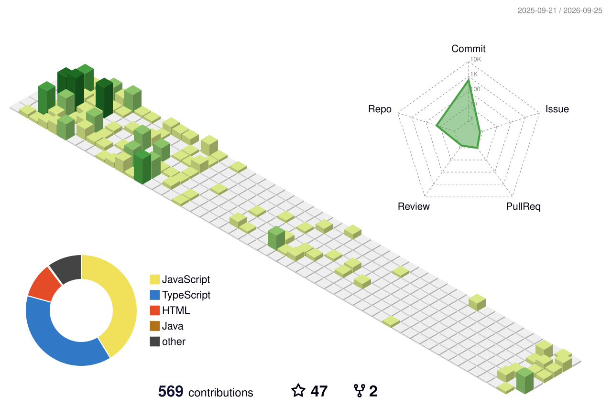

<!-- ========================================================= -->

<!--                    OUSSAMA TARIGHT                         -->

<!--                  GITHUB PROFILE README                     -->

<!-- ========================================================= -->

<!-- ========================= HERO ========================== -->

<p align="center">
  
</p>

<p align="center">
  
</p>

<p align="center">

  <a href="https://github.com/oussamatght">
    
  </a>

  <a href="https://linkedin.com/in/tarightoussama">
    
  </a>

  <a href="mailto:oussamatght6@gmail.com">
    
  </a>

  <a href="https://discord.gg/oussamatght">
    
  </a>

  <a href="https://instagram.com/oussama_soul_">
    
  </a>

</p>

<p align="center">
  
</p>

<!-- ======================= ABOUT ME ======================== -->

## 👨‍💻 About Me

```ts
const oussamaTaright = {
  role: "Full-Stack Developer",
  education: "Computer Science Student @ USTHB",

  frontend: [
    "React",
    "Next.js",
    "TypeScript",
    "React Native",
    "Tailwind CSS"
  ],

  backend: [
    "Node.js",
    "Express.js",
    "NestJS",
    "REST APIs"
  ],

  databases: [
    "PostgreSQL",
    "MongoDB",
    "MySQL",
    "Redis"
  ],

  currentlyLearning: [
    "Docker",
    "Linux",
    "AWS",
    "DevOps",
    "AI Integration",
    "LLMs",
    "RAG"
  ],

  interests: [
    "Clean Architecture",
    "Scalable Applications",
    "Developer Tools",
    "AI-Powered Products"
  ]
};
```

> I build full-stack web and mobile applications with a focus on clean architecture,
> practical solutions, scalable systems, and polished user experiences.

<p align="center">
  
</p>

<!-- ======================= CURRENT MISSION ================= -->


<p align="center">
  
</p>

<!-- ======================= TECH STACK ====================== -->

## 🧰 Tech Stack

### 💻 Languages

<p>
  
</p>

### 🎨 Frontend

<p>
  
</p>

### ⚙️ Backend

<p>
  
</p>

### 🗄️ Databases & Storage

<p>
  
</p>

### 📱 Mobile

<p>
  
</p>

### 🐳 DevOps & Tools

<p>
  
</p>

<p align="center">
  
</p>

<!-- ======================= 3D GRAPH ======================== -->

## 🧊 3D Contribution Universe

<p align="center">
  
</p>

<p align="center">
  <sub>
    ⚡ Automatically generated from GitHub contribution activity.
  </sub>
</p>

<p align="center">
  
</p>

<!-- ======================= GITHUB ANALYTICS ================= -->

## 📊 GitHub Analytics

<p align="center">


</p>

<p align="center">
  <sub>
    Generated automatically with GitHub Actions.
  </sub>
</p>

<p align="center">
  
</p>

<!-- ===================== FEATURED PROJECTS ================= -->

## 🚀 Featured Projects

### 🛒 WASSLA

<p>
  <b>Full-Stack Marketplace & Delivery Platform</b>
</p>

```text
React Native
Expo
Node.js
Express.js
MongoDB
Socket.io
Firebase
Cloudinary
REST APIs
```

<p>
  <a href="https://github.com/oussamatght/wassel-APP">
    
  </a>
</p>

### 📚 Islamic Library

<p>
  <b>Modern Islamic Content & Learning Application</b>
</p>

```text
React Native
Expo
TypeScript
Zustand
React Query
Quran
Hadith
Adhkar
API Integration
```

<p>
  <a href="https://github.com/oussamatght/islamic-library-shamela">
    
  </a>
</p>

### 📋 Task Manager

<p>
  <b>Modern Task Management Application</b>
</p>

```text
Next.js
TypeScript
React
Zustand
React Query
Zod
```

<p>
  <a href="https://github.com/oussamatght/Task-Manager">
    
  </a>
</p>

<p align="center">
  
</p>

<!-- ======================== ROADMAP ======================== -->

## 🗺️ Developer Roadmap

```text
                 FULL-STACK DEVELOPMENT
                          │
                          ▼
                 BACKEND ENGINEERING
                          │
                          ▼
                   DOCKER + LINUX
                          │
                          ▼
                    AWS / CLOUD
                          │
                          ▼
                    DEVOPS / CI-CD
                          │
                          ▼
                  AI INTEGRATION
                          │
                    ┌─────┴─────┐
                    ▼           ▼
                   LLMs        RAG
                    │           │
                    └─────┬─────┘
                          ▼
                    AI AGENTS
                          │
                          ▼
              AI-POWERED SOFTWARE ENGINEER
```

<p align="center">
  
</p>

<!-- ======================== ACTIVITY ======================= -->

## ⚡ Contribution Activity

<p align="center">
  
</p>

<p align="center">
  <sub>
    Learning → Building → Testing → Shipping → Improving
  </sub>
</p>

<p align="center">
  
</p>


<!-- ========================= FOOTER ======================== -->

<p align="center">
  
</p>

<p align="center">
  <sub>
    ⚡ Build things. Learn deeply. Ship consistently.
  </sub>
</p>

<p align="center">
  <sub>
    © Oussama Taright
  </sub>
</p>
