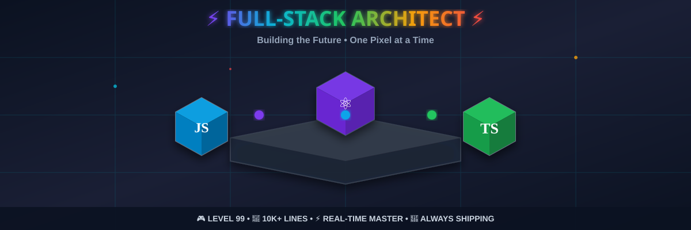

<!-- Animated 3D Hero Banner -->

<!-- Interactive 3D Isometric Scene with Game Elements (external SVG to avoid GitHub sanitizing inline SVG) -->

<!-- Premium Game HUD -->
<svg width="100%" height="100" viewBox="0 0 1200 100" xmlns="http://www.w3.org/2000/svg" role="img" aria-label="Professional Game HUD">
	<defs>
		<linearGradient id="hudGrad" x1="0%" y1="0%" x2="100%" y2="0%">
			<stop offset="0%" stop-color="#1a1f35" />
			<stop offset="50%" stop-color="#0B1221" />
			<stop offset="100%" stop-color="#1a1f35" />
		</linearGradient>
		<linearGradient id="xpBar" x1="0%" y1="0%" x2="100%" y2="0%">
			<stop offset="0%" stop-color="#06B6D4" />
			<stop offset="50%" stop-color="#7C3AED" />
			<stop offset="100%" stop-color="#EF4444" />
		</linearGradient>
	</defs>
    
	<rect x="0" y="0" width="1200" height="100" fill="url(#hudGrad)" />
	<rect x="10" y="10" width="1180" height="80" fill="#0B1221" stroke="#374151" stroke-width="2" rx="8" />
    
	<!-- Health/Status -->
	<g transform="translate(30, 35)">
		<text x="0" y="20" font-size="16" fill="#94A3B8" font-weight="600">STATUS</text>
		<text x="0" y="42" font-size="32">❤️ ❤️ ❤️</text>
	</g>
    
	<!-- Resources -->
	<g transform="translate(200, 35)">
		<text x="0" y="20" font-size="16" fill="#94A3B8" font-weight="600">COMMITS</text>
		<text x="0" y="45" font-size="28" fill="#FDE68A">⭐ x 500+</text>
	</g>
    
	<!-- XP Progress Bar -->
	<g transform="translate(400, 35)">
		<text x="0" y="20" font-size="16" fill="#94A3B8" font-weight="600">EXPERIENCE</text>
		<rect x="0" y="25" rx="10" ry="10" width="450" height="28" fill="#1F2937" stroke="#374151" stroke-width="2" />
		<rect x="3" y="28" rx="8" ry="8" width="380" height="22" fill="url(#xpBar)" />
		<text x="225" y="45" text-anchor="middle" font-size="14" fill="white" font-weight="700">LEVEL 99 • 84% TO MAX</text>
	</g>
    
	<!-- Action Button -->
	<g transform="translate(920, 35)">
		<rect x="0" y="15" rx="12" ry="12" width="240" height="40" fill="#7C3AED" stroke="#9333EA" stroke-width="2" filter="url(#glow)" />
		<text x="120" y="42" text-anchor="middle" font-size="18" fill="white" font-weight="700">▶ START GAME</text>
		<animate attributeName="opacity" values="1;0.7;1" dur="1.5s" repeatCount="indefinite" />
	</g>
</svg>

<!-- Typing Animation -->

 

<!-- Social Badges with Glow Effect -->

---

## 🎮 MINI GAME: Code Quest Challenge

🕹️ <b>CLICK TO PLAY</b> - Test Your Developer Skills!

 

### 🎯 Mission Objectives

- Level 1: Fix Bugs
  - [ ] Polish README visuals and layout
  - [ ] Push clean, meaningful commits
  - [ ] Lint and format code
- Level 2: Ship Features
  - [ ] Add i18n (Arabic, French, English)
  - [ ] Implement real-time chat (WebSocket)
  - [ ] Dark/Light theme toggle
- Boss Fight: Deploy
  - [ ] Frontend on Vercel
  - [ ] Backend on Render
  - [ ] Configure env vars (HTTP/WS)

### ⚙️ Controls

- Start: Click badges and explore projects
- Move: Scroll through sections (Quest Log, Skill Tree, Leaderboard)
- Action: Star repos, fork, and contribute

### 🏆 Rewards

- +100 XP: Every merged PR
- +50 XP: Each useful issue or discussion
- +10 XP: Daily commits streak

---

## 🎮 Quest Log

Leveling up full‑stack builds with real‑time features.

- 🎯 Current quest: WebSocket experiences, mobile‑first UI
- 📚 Study: L2 Computer Science @ USTHB
- 🏆 Focus: System design, scalable architectures
- ⚡ Next skill: Advanced TypeScript, microservices, cloud

---

## 🧩 Skill Tree

---

## 🏁 Leaderboard

---

## 🏆 Achievements & Activity

---

## 🔧 Power-Ups

- ✅ Full-Stack: from UI to API
- ✅ Real-Time Systems: WebSocket, live updates
- ✅ Responsive Design: mobile-first, RTL/LTR
- ✅ Data & Auth: schema modeling, JWT
- ✅ Deployment: Vercel/Render, CI/CD
- ✅ Problem Solving: architecture, debugging

---

## 📫 Let's Connect

I'm open to collaborations, internships, and freelance opportunities.

- 💼 LinkedIn: [tarightoussama](https://linkedin.com/in/tarightoussama)
- 📧 Email: [oussamatght6@gmail.com](mailto:oussamatght6@gmail.com)
- 💬 Discord: [oussamatght](https://discord.gg/oussamatght)
- 📸 Instagram: [@oussama*soul*](https://instagram.com/oussama_soul_)

✨ _"Code is a solution to real-world problems"_ ✨

<!-- Proudly created with GPRM ( https://gprm.itsvg.in ) -->
