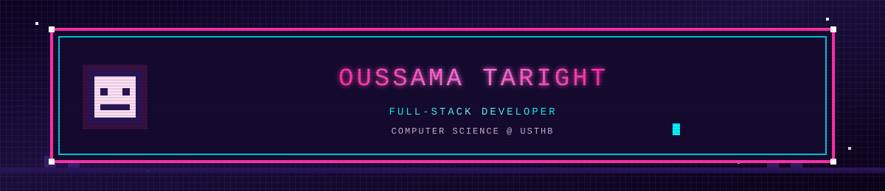

<!-- Pixel Animated Header -->

  

  

  

# 💫 About Me
👋 Hi, I'm **Oussama Taright**, a Full-Stack Developer and Computer Science student at USTHB. I build modern web and mobile apps using Next.js, TypeScript, Express, MongoDB, PostgreSQL, Tailwind CSS, and React Native, delivering responsive and scalable solutions.

💻 I enjoy designing clean architectures, building end-to-end applications, and exploring new technologies to refine my skills.

  

## 🌐 Socials
   

## 💻 Tech Stack
                         

  

## 📊 GitHub Stats

 

 

  

