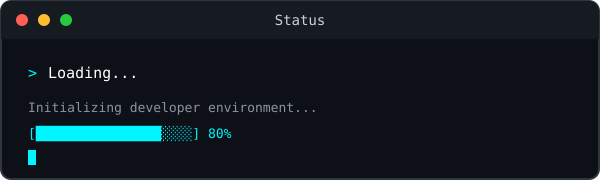

<!-- ========================================================= -->

<!--                    OUSSAMA TARIGHT                         -->

<!--                  GITHUB PROFILE README                     -->

<!-- ========================================================= -->

<!-- ========================= HERO ========================== -->

<p align="center">
  
</p>

<p align="center">
  
</p>

<p align="center">

  <a href="https://github.com/oussamatght">
    
  </a>

  <a href="https://linkedin.com/in/tarightoussama">
    
  </a>

  <a href="mailto:oussamatght6@gmail.com">
    
  </a>

  <a href="https://instagram.com/oussama_soul_">
    
  </a>

</p>

<p align="center">
  
</p>

<!-- ======================= ABOUT ME ======================== -->

## 👨‍💻 About Me

```ts
const oussamaTaright = {
  role: "Full-Stack Developer",
  education: "Computer Science Student @ USTHB",

  frontend: [
    "React",
    "Next.js",
    "TypeScript",
    "React Native",
    "Tailwind CSS"
  ],

  backend: [
    "Node.js",
    "Express.js",
    "NestJS",
    "REST APIs"
  ],

  databases: [
    "PostgreSQL",
    "MongoDB",
    "MySQL",
    "Redis"
  ],

  currentlyLearning: [
    "Docker",
    "Linux",
    "AWS",
    "DevOps",
    "AI Integration",
    "LLMs",
    "RAG"
  ],

  interests: [
    "Clean Architecture",
    "Scalable Applications",
    "Developer Tools",
    "AI-Powered Products",
    "EdTech"
  ]
};
```

> I build full-stack web and mobile applications with a focus on clean architecture,
> practical solutions, scalable systems, and polished user experiences.

<p align="center">
  
</p>

<!-- ======================= CURRENT MISSION ================= -->


<p align="center">
  
</p>

<!-- ======================= TECH STACK ====================== -->

## 🧰 Tech Stack

### 💻 Languages

<p>
  
</p>

### 🎨 Frontend

<p>
  
</p>

### ⚙️ Backend

<p>
  
</p>

### 🗄️ Databases & Storage

<p>
  
</p>

### 📱 Mobile

<p>
  
</p>

### 🐳 DevOps & Tools

<p>
  
</p>

<p align="center">
  
</p>

<!-- ======================= 3D GRAPH ======================== -->

## 🧊 3D Contribution Universe

<p align="center">
  
</p>
<p align="center">
  <sub>
    ⚡ Automatically generated from GitHub contribution activity.
  </sub>
</p>

<p align="center">
  
</p>

<!-- ======================= GITHUB ANALYTICS ================= -->

## 📊 GitHub Analytics

<p align="center">





</p>

<p align="center">
  <sub>
    Generated automatically with GitHub Actions.
  </sub>
</p>

<p align="center">
  
</p>

<!-- ===================== FEATURED PROJECTS ================= -->

## 🚀 Featured Projects

<!-- =========================== WASSLA ====================== -->

### 🛒 WASSLA

<p>
  <b>Full-Stack Marketplace & Delivery Platform</b>
</p>

<p>
  A real-world marketplace and delivery platform connecting customers,
  sellers, drivers, and service providers.
</p>

```text
React Native
Expo
Node.js
Express.js
MongoDB
Socket.io
Firebase
Cloudinary
REST APIs
Real-Time Tracking
Payment Integration
```

### 📱 Live Mobile Application

<p align="center">

  <a href="https://play.google.com/store/apps/details?id=com.wassla.dz.app">
    
  </a>

  <a href="https://apps.apple.com/us/app/wassla-app/id6782409544">
    
  </a>

</p>

<p align="center">
  <sub>
    🚀 WASSLA is live on both Android and iOS.
  </sub>
</p>

<p>
  <b>Note:</b> The production application repository is private.
</p>

<!-- ===================== AI AGENT ========================== -->

### 🤖 Oussama AI Agent

<p>
  <b>AI-Powered Full-Stack Assistant Platform</b>
</p>

<p>
  A modern AI agent platform built with Next.js and TypeScript,
  designed around intelligent assistant capabilities, API automation,
  interactive chat, and scalable data handling.
</p>

```text
Next.js
TypeScript
React
Tailwind CSS
MongoDB
AI Agents
API Automation
Interactive Chat
REST APIs
Responsive UI
```

<p>
  <a href="https://github.com/oussamatght/oussama-ai-agent-frontend">
    
  </a>

  <a href="https://oussama-ai-agent.onrender.com">
    
  </a>
</p>

<!-- ===================== GDG HACK ========================== -->

### 🏆 GDG Hack Frontend

<p>
  <b>🥇 1st Place — GDG Hackathon</b>
</p>

<p>
  A gamified frontend learning platform where students learn,
  practice, progress through stages, unlock challenges, and
  participate in game-inspired learning experiences.
</p>

```text
Next.js
TypeScript
React
Tailwind CSS
JWT
REST APIs
Vercel
Gamification
Multiplayer
AI Chatbot
```

### 🎮 Core Experience

```text
        ┌──────────────┐
        │    LESSON    │
        └──────┬───────┘
               ↓
        ┌──────────────┐
        │   PRACTICE   │
        └──────┬───────┘
               ↓
        ┌──────────────┐
        │   PROGRESS   │
        └──────┬───────┘
               ↓
        ┌──────────────┐
        │    UNLOCK    │
        └──────┬───────┘
               ↓
        ┌──────────────────┐
        │  BOSS / CHALLENGE│
        └──────┬───────────┘
               ↓
        ┌──────────────┐
        │    REWARD    │
        └──────────────┘
```

<p>
  <a href="https://github.com/oussamatght/GDG-HACK-FRONTEND">
    
  </a>

  <a href="https://gdg-hack-frontend-738x.vercel.app/">
    
  </a>
</p>

<!-- ===================== CHOUFPRICE ======================== -->

### 🇩🇿 ChoufPrice DZ

<p>
  <b>Live Price Monitoring Platform for Algeria</b>
</p>

<p>
  A community-driven platform designed to help Algerians monitor,
  compare, and share product prices across Algeria.
</p>

```text
Next.js 16
TypeScript
Tailwind CSS
Leaflet
shadcn/ui
Radix UI
React Hook Form
Zod
JWT
Vercel
```

### 📊 Platform Highlights

```text
58 Wilayas
300+ Products
54,900+ Price Reports
Interactive Price Map
Community Reports
Price Alerts
Community Chat
Voting System
Statistics Dashboard
```

<p>
  <a href="https://github.com/oussamatght/ChoufPrice-DZ-Platform">
    
  </a>

  <a href="https://chouf-price-dz-platform.vercel.app/">
    
  </a>
</p>

<!-- ======================= GCL HUB ========================= -->

### 🌐 GCL Hub

<p>
  <b>GDG Club & Event Management Platform</b>
</p>

<p>
  A modern platform for GDG communities where students can discover
  events, join clubs, interact with communities, and access
  AI-powered assistance.
</p>

```text
Next.js
React
TypeScript
Tailwind CSS
shadcn/ui
REST APIs
Crew AI
Axios
LocalStorage
Vercel
Render
```

### 🏆 Achievement

```text
🥇 Best Development Team
       │
       ▼
GDG Competition
       │
       ▼
Modern Event Platform
       │
       ├── Events
       ├── Clubs
       ├── Posts
       ├── Community
       └── AI Assistant
```

<p>
  <a href="https://github.com/oussamatght/club-student-hub">
    
  </a>

  <a href="https://club-student-hub.vercel.app">
    
  </a>
</p>

<!-- ======================== SLIDES ========================= -->

### 🎨 Web Development Slides

<p>
  <b>Interactive Educational Resources & Training Materials</b>
</p>

<p>
  A growing collection of visual presentations and practical
  learning materials for teaching modern web development.
</p>

```text
HTML
CSS
JavaScript
React
Git
GitHub
SVG
Web Development
Workshops
Training Materials
```

### 🧑‍🏫 Educational Focus

```text
HTML
  ↓
CSS
  ↓
JavaScript
  ↓
React
  ↓
Git & GitHub
  ↓
Modern Web Development
```

<p>
  <a href="https://github.com/oussamatght/slides">
    
  </a>
</p>


<p align="center">
  
</p>

<!-- ======================== CONNECT ======================== -->


<!-- ========================= FOOTER ======================== -->


<p align="center">
  <sub>
    ⚡ Build things. Learn deeply. Ship consistently.
  </sub>
</p>

<p align="center">
  <sub>
    © Oussama Taright
  </sub>
</p>
