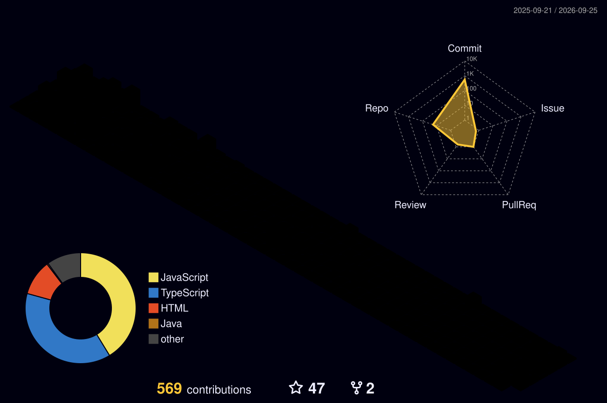
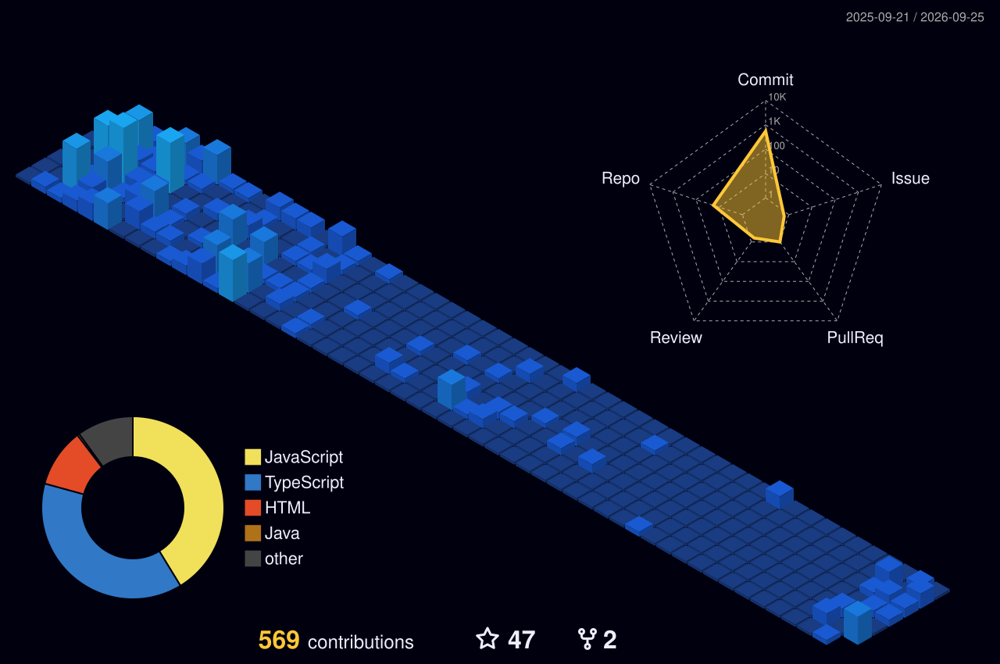

<!-- ========================================================= -->

<!--                    OUSSAMA TARIGHT                         -->

<!--                  GITHUB PROFILE README                     -->

<!-- ========================================================= -->

<!-- ========================= HERO ========================== -->

<p align="center">
  
</p>

<p align="center">
  
</p>

<p align="center">
  <a href="https://github.com/oussamatght">
    
  </a>
  <a href="https://linkedin.com/in/tarightoussama">
    
  </a>
  <a href="mailto:oussamatght6@gmail.com">
    
  </a>
  <a href="https://discord.gg/oussamatght">
    
  </a>
  <a href="https://instagram.com/oussama_soul_">
    
  </a>
</p>

<p align="center">
  
</p>

<!-- ======================= ABOUT ME ======================== -->

## 👨‍💻 About Me

```ts
const oussamaTaright = {
  role: "Full-Stack Developer",
  education: "Computer Science Student @ USTHB",

  frontend: [
    "React",
    "Next.js",
    "TypeScript",
    "React Native",
    "Tailwind CSS"
  ],

  backend: [
    "Node.js",
    "Express.js",
    "REST APIs"
  ],

  databases: [
    "PostgreSQL",
    "MongoDB",
    "MySQL",
    "Redis"
  ],

  currentlyLearning: [
    "NestJS",
    "Docker",
    "Linux",
    "AWS",
    "DevOps",
    "AI Integration"
  ],

  interests: [
    "Clean Architecture",
    "Scalable Applications",
    "Developer Tools",
    "AI-Powered Products"
  ]
};
```

> I build full-stack web and mobile applications with a focus on clean architecture,
> practical solutions, scalable systems, and polished user experiences.

<p align="center">
  
</p>

<!-- ======================= CURRENTLY ======================= -->

## ⚡ Currently Building & Learning

```text
┌─────────────────────────────────────────────────────────────┐
│                    CURRENT MISSION                          │
├─────────────────────────────────────────────────────────────┤
│                                                             │
│  ███████████████████░░░░░░  Full-Stack Development         │
│                                                             │
│  ████████████████░░░░░░░░░  Backend Engineering             │
│                                                             │
│  █████████████░░░░░░░░░░░░  Docker + Linux                  │
│                                                             │
│  ██████████░░░░░░░░░░░░░░░  Cloud + DevOps                  │
│                                                             │
│  ████████░░░░░░░░░░░░░░░░░  AI Integration                  │
│                                                             │
└─────────────────────────────────────────────────────────────┘
```

### 🎯 Current Focus

* 🧠 TypeScript & advanced frontend architecture
* ⚛️ Next.js + React ecosystem
* 📱 React Native / Expo
* 🚀 Node.js / NestJS backend development
* 🗄️ PostgreSQL + MongoDB + Redis
* 🐳 Docker & Linux
* ☁️ Cloud & DevOps
* 🤖 LLMs, RAG & AI-powered applications

<p align="center">
  
</p>

<!-- ======================= TECH STACK ====================== -->

## 🧰 Tech Stack

### 💻 Languages

<p>
  
</p>

### 🎨 Frontend

<p>
  
</p>

### ⚙️ Backend

<p>
  
</p>

### 🗄️ Databases & Storage

<p>
  
</p>

### 📱 Mobile

<p>
  
</p>

### 🐳 DevOps & Tools

<p>
  
</p>

<p align="center">
  
</p>

<!-- ======================= 3D GRAPH ======================== -->

## 🧊 3D Contribution Universe

<p align="center">
  
</p>

<p align="center">
  <sub>Generated automatically from my GitHub contribution activity.</sub>
</p>

<p align="center">
  
</p>

<!-- ======================= GITHUB STATS ==================== -->

## 📊 GitHub Analytics

<p align="center">
  
  
</p>

<p align="center">
  
</p>

<!-- ======================= TROPHIES ======================== -->

## 🏆 GitHub Trophies

<p align="center">
  
</p>

<p align="center">
  
</p>

<!-- ===================== FEATURED PROJECTS ================= -->

## 🚀 Featured Projects

<p align="center">

  <a href="https://github.com/oussamatght/wassel-APP">
    
  </a>

  <a href="https://github.com/oussamatght/islamic-library-shamela">
    
  </a>

</p>


<p align="center">
  
</p>


<p align="center">
  <sub>Learning → Building → Testing → Shipping → Improving</sub>
</p>

<!-- ======================== ACTIVITY ======================= -->

## 🔥 Contribution Activity

<p align="center">
  
</p>

<p align="center">
  
</p>

<!-- ======================= CONNECT ========================= -->

## 🌐 Connect With Me

<p align="center">

  <a href="https://github.com/oussamatght">
    
  </a>

  <a href="https://linkedin.com/in/tarightoussama">
    
  </a>

  <a href="mailto:oussamatght6@gmail.com">
    
  </a>

  <a href="https://discord.gg/oussamatght">
    
  </a>

</p>

<!-- ========================= FOOTER ======================== -->

<p align="center">
  
</p>

<p align="center">
  
</p>

<p align="center">
  <sub>
    ⚡ Build things. Learn deeply. Ship consistently.
  </sub>
</p>
